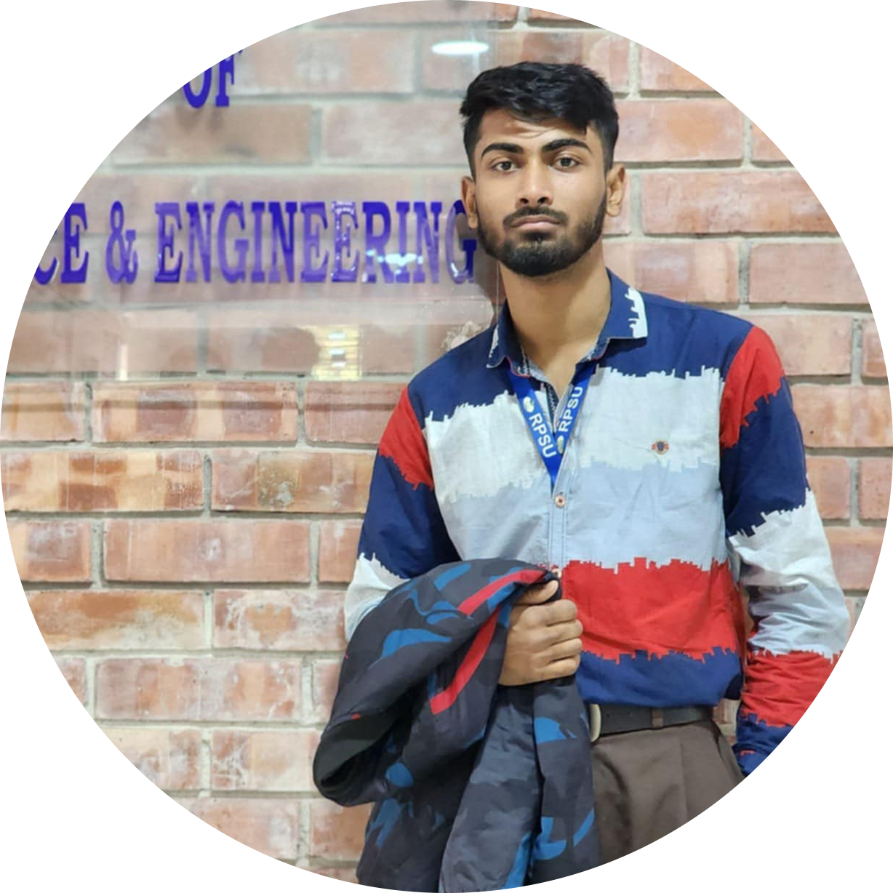

# 👨‍💻 Md Siam Hossain

🎓 CSE Student | 💻 Competitive Programmer | 🚀 Future Software Engineer

 <!-- Replace this with actual photo URL if available -->

---

## 🔗 Connect with Me

[LinkedIn](www.linkedin.com/in/siam-hossain-33305a25b) | [GitHub](https://github.com/hossainsiam133) | [Email](www.cpsiam221@gmail.com) | [Codeforces](https://codeforces.com/profile/Siam84)

---

## 🧑‍💼 About Me

Passionate **competitive programmer**, **problem solver**, and **quick learner** aiming for an entry-level software engineering role. I am committed to growing my skills in algorithmic thinking, software development, and real-world problem solving.

---

## 💡 Skills

- **Languages:** C, C++, Java, HTML, CSS, JavaScript, PHP  
- **Technologies:** Java Swing, Laravel 
- **Soft Skills:** Problem Solving, Fast Learner, Teamwork

---

## 🏆 Competitive Programming

### 🧠 Codeforces  
- Solved **500+ problems** across various categories  
- **Current Rating:** 879 (Max: 985)  
- **Specialist**

### 💥 CodeChef  
- Solved **150+ problems**  
- **Current Rating:** 1185 (Highest: 1257)  
- **1★ (One Star) Coder**

---

## 🥇 Achievements

- 🏆 **Champion** – Intra RPSU Programming Contest, May 2025  
- 🌍 **ICPC Regional Participant** – International Collegiate Programming Contest

---

## 🎓 Education

**B.Sc. in Computer Science and Engineering**  
📍 R. P. Shaha University (2023 – Present)

---

## 🧠 Languages

- 🇧🇩 Bangla (Native)  
- 🌐 English (Professional)

---

## 💻 Projects

### 🔧 Election Management System | [GitHub]()  
**Features:**
<!-- Dynamically generates class routines using recursive and backtracking logic -->
<!-- Considers teacher availability and constraints -->

**Technologies Used:**
<!--| Tool         | Purpose                  |
|--------------|--------------------------|
| JavaFX       | Desktop app development  |
| SceneBuilder | UI design                | -->

---

## 👑 Leadership Experience

- 🖇️ **Programming Co-ordinator** at RPSU CSE Society (Present)  
- 🗣️ **Assistant Trainer for CP** at RPSU CSE Society (Present)

---

⭐ *Thanks for visiting my GitHub profile! Feel free to explore my projects and connect!*
